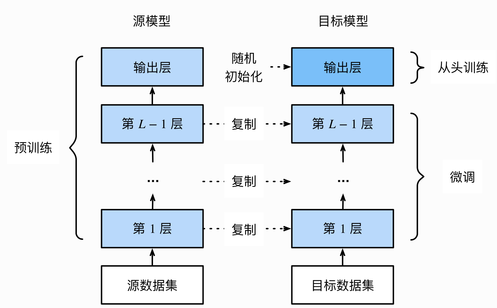

# 6.2 动态调整学习率

学习率的选择是深度学习中一个困扰人们许久的问题：

- 学习速率设置过小，会极大降低收敛速度，增加训练时间；
- 学习率太大，可能导致参数在最优解两侧来回振荡。

当我们选定了一个合适的学习率后，经过许多轮的训练后，可能会出现准确率震荡或loss不再下降等情况，说明当前学习率已不能满足模型调优的需求。此时我们就可以通过一个适当的学习率衰减策略来改善这种现象，提高我们的精度。这种设置方式在PyTorch中被称为**scheduler**，也是我们本节所研究的对象。

经过本节的学习，你将收获：

- 如何根据需要选取已有的学习率调整策略
- 如何自定义设置学习调整策略并实现

## 6.2.1 使用官方scheduler

- **了解官方提供的API**

在训练神经网络的过程中，学习率是最重要的超参数之一，作为当前较为流行的深度学习框架，PyTorch已经在`torch.optim.lr_scheduler`为我们封装好了一些动态调整学习率的方法供我们使用，如下面列出的这些scheduler。

- [`lr_scheduler.LambdaLR`](https://pytorch.org/docs/stable/generated/torch.optim.lr_scheduler.LambdaLR.html#torch.optim.lr_scheduler.LambdaLR)
- [`lr_scheduler.MultiplicativeLR`](https://pytorch.org/docs/stable/generated/torch.optim.lr_scheduler.MultiplicativeLR.html#torch.optim.lr_scheduler.MultiplicativeLR)
- [`lr_scheduler.StepLR`](https://pytorch.org/docs/stable/generated/torch.optim.lr_scheduler.StepLR.html#torch.optim.lr_scheduler.StepLR)
- [`lr_scheduler.MultiStepLR`](https://pytorch.org/docs/stable/generated/torch.optim.lr_scheduler.MultiStepLR.html#torch.optim.lr_scheduler.MultiStepLR)
- [`lr_scheduler.ExponentialLR`](https://pytorch.org/docs/stable/generated/torch.optim.lr_scheduler.ExponentialLR.html#torch.optim.lr_scheduler.ExponentialLR)
- [`lr_scheduler.CosineAnnealingLR`](https://pytorch.org/docs/stable/generated/torch.optim.lr_scheduler.CosineAnnealingLR.html#torch.optim.lr_scheduler.CosineAnnealingLR)
- [`lr_scheduler.ReduceLROnPlateau`](https://pytorch.org/docs/stable/generated/torch.optim.lr_scheduler.ReduceLROnPlateau.html#torch.optim.lr_scheduler.ReduceLROnPlateau)
- [`lr_scheduler.CyclicLR`](https://pytorch.org/docs/stable/generated/torch.optim.lr_scheduler.CyclicLR.html#torch.optim.lr_scheduler.CyclicLR)
- [`lr_scheduler.OneCycleLR`](https://pytorch.org/docs/stable/generated/torch.optim.lr_scheduler.OneCycleLR.html#torch.optim.lr_scheduler.OneCycleLR)
- [`lr_scheduler.CosineAnnealingWarmRestarts`](https://pytorch.org/docs/stable/generated/torch.optim.lr_scheduler.CosineAnnealingWarmRestarts.html#torch.optim.lr_scheduler.CosineAnnealingWarmRestarts)
- **使用官方API**

关于如何使用这些动态调整学习率的策略，`PyTorch`官方也很人性化的给出了使用实例代码帮助大家理解，我们也将结合官方给出的代码来进行解释。

```python
# 选择一种优化器
optimizer = torch.optim.Adam(...) 
# 选择上面提到的一种或多种动态调整学习率的方法
scheduler1 = torch.optim.lr_scheduler.... 
scheduler2 = torch.optim.lr_scheduler....
...
schedulern = torch.optim.lr_scheduler....
# 进行训练
for epoch in range(100):
    train(...)
    validate(...)
    optimizer.step()
    # 需要在优化器参数更新之后再动态调整学习率
	scheduler1.step() 
	...
    schedulern.step()
```

**注**：

我们在使用官方给出的`torch.optim.lr_scheduler`时，需要将`scheduler.step()`放在`optimizer.step()`后面进行使用。

## 6.2.2 使用自定义的sheduler

虽然PyTorch官方给我们提供了许多的API，但是在实验中也有可能碰到需要我们自己定义学习率调整策略的情况，而我们的方法是：

- 自定义函数`adjust_learning_rate`来改变`param_group`中`lr`的值，在下面的叙述中会给出一个简单的实现。
- 假设我们现在正在做实验，需要学习率每30轮下降为原来的1/10，假设已有的官方API中没有符合我们需求的，那就需要自定义函数来实现学习率的改变。

```python
def adjust_learning_rate(optimizer, epoch):
    lr = args.lr * (0.1 ** (epoch // 30))
    for param_group in optimizer.param_groups:
        param_group['lr'] = lr
```

有了`adjust_learning_rate`函数的定义，在训练的过程就可以调用我们的函数来实现学习率的动态变化

```python
def adjust_learning_rate(optimizer,...):
    ...
optimizer = torch.optim.SGD(model.parameters(),lr = args.lr,momentum = 0.9)
for epoch in range(10):
    train(...)
    validate(...)
    adjust_learning_rate(optimizer,epoch)
```

# 6.3 模型微调

- 背景：
  - 随着深度学习的发展，模型的参数越来越大，许多开源模型都是在较大数据集上进行训练的，比如Imagenet-1k，Imagenet-11k，甚至是ImageNet-21k等。但在实际应用中，我们的数据集可能只有几千张，这时从头开始训练具有几千万参数的大型神经网络是不现实的，因为越大的模型对数据量的要求越大，过拟合无法避免。
  - 假设我们想从图像中识别出不同种类的椅⼦，然后将购买链接推荐给用户。一种可能的方法是先找出100种常见的椅子，为每种椅子拍摄1000张不同⻆度的图像，然后在收集到的图像数据集上训练一个分类模型。这个椅子数据集虽然可能比Fashion-MNIST数据集要庞⼤，但样本数仍然不及ImageNet数据集中样本数的十分之⼀。这可能会导致适用于ImageNet数据集的复杂模型在这个椅⼦数据集上过拟合。同时，因为数据量有限，最终训练得到的模型的精度也可能达不到实用的要求。
  - 为了应对上述问题，一个显⽽易⻅的解决办法是收集更多的数据。然而，收集和标注数据会花费大量的时间和资⾦。例如，为了收集ImageNet数据集，研究人员花费了数百万美元的研究经费。虽然目前的数据采集成本已降低了不少，但其成本仍然不可忽略。

- 迁移学习(transfer learning)，将从源数据集学到的知识迁移到目标数据集上。例如，虽然ImageNet数据集的图像大多跟椅子无关，但在该数据集上训练的模型可以抽取较通用的图像特征，从而能够帮助识别边缘、纹理、形状和物体组成等。这些类似的特征对于识别椅子也可能同样有效。

## 6.3.1 迁移学习的一般步骤

- 迁移学习的一大应用场景是模型微调（finetune）。简单来说：
  - 在源数据集(如ImageNet数据集)上预训练一个神经网络模型，即源模型。
  - 创建一个新的神经网络模型，即目标模型。它复制了源模型上除了输出层外的所有模型设计及其参数。我们假设这些模型参数包含了源数据集上学习到的知识，且这些知识同样适用于目标数据集。我们还假设源模型的输出层跟源数据集的标签紧密相关，因此在目标模型中不予采用。
  - 为目标模型添加一个输出⼤小为⽬标数据集类别个数的输出层，并随机初始化该层的模型参数。
  - 在目标数据集上训练目标模型。我们将从头训练输出层，而其余层的参数都是基于源模型的参数微调得到的。



​	
