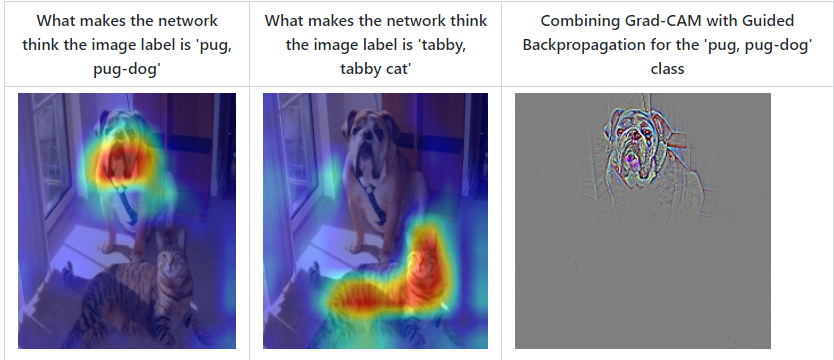

# 7.2 CNN可视化

- 卷积神经网络（CNN）是深度学习中非常重要的模型结构，它广泛地用于图像处理，极大地提升了模型表现，推动了计算机视觉的发展和进步。
- 但CNN是一个“黑盒模型”，人们并不知道CNN是如何获得较好表现的，由此带来了深度学习的可解释性问题。如果能理解CNN工作的方式，人们不仅能够解释所获得的结果，提升模型的鲁棒性，而且还能有针对性地改进CNN的结构以获得进一步的效果提升。

- 理解CNN的重要一步是可视化，包括可视化特征是如何提取的、提取到的特征的形式以及模型在输入数据上的关注点等。本节我们就从上述三个方面出发，介绍如何在PyTorch的框架下完成CNN模型的可视化。

## 7.2.1 可视化卷积核

```python
# -*- coding: utf-8 -*—
# Date: 2022/3/21 0021
# Time: 20:23
# Author: HQR

import torch
from torchvision.models import vgg11
import matplotlib.pyplot as plt
plt.rcParams.update({'figure.max_open_warning': 0})

model = vgg11(pretrained=True)
print(dict(model.features.named_children()))

conv1 = dict(model.features.named_children())['3']
kernel_set = conv1.weight.detach()
num = len(conv1.weight.detach())
print('kernel shape is: ', kernel_set.shape)
for i in range(0, num):
    i_kernel = kernel_set[i]
    plt.figure(figsize=(20, 17))
    if (len(i_kernel)) > 1:
        for idx, filer in enumerate(i_kernel):
            plt.subplot(8, 8, idx+1)
            # plt.axis('off')
            plt.imshow(filer[:, :].detach(), cmap='bwr')
        plt.show()
```


## 7.2.2 可视化激活层
class activation map （CAM）的作用是判断哪些变量对模型来说是重要的，在CNN可视化的场景下，即判断图像中哪些像素点对预测结果是重要的。除了确定重要的像素点，人们也会对重要区域的梯度感兴趣，因此在CAM的基础上也进一步改进得到了Grad-CAM（以及诸多变种）。CAM和Grad-CAM的示例如下图所示：

- 安装

```python
pip install grad-cam
```
- 具体操作
参考本人博客：https://blog.csdn.net/huang1024rui/article/details/119221011

## 7.2.3 使用FlashTorch快速实现CNN可视化
随着PyTorch社区的努力，目前已经有不少开源工具能够帮助我们快速实现CNN可视化。这里我们介绍其中的一个——[FlashTorch](https://github.com/MisaOgura/flashtorch)。
- 安装

```python
pip install flashtorch
```
