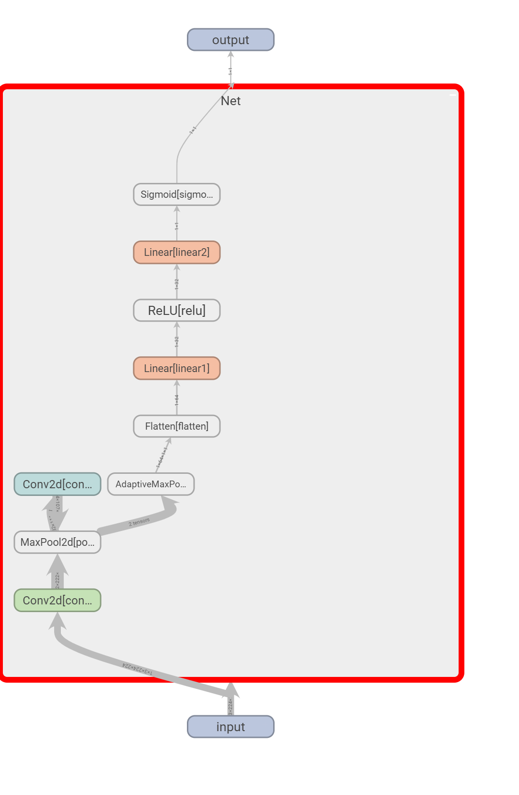

# 7.3 使用TensorBoard可视化训练过程

- 学习的过程是一个优化的过程，我们需要找到最优的点作为训练过程的输出产物。一般来说，我们会结合训练集的损失函数和验证集的损失函数，绘制两条损失函数的曲线来确定训练的终点，找到对应的模型用于测试。
- 我们也希望可视化其他内容，如输入数据（尤其是图片）、模型结构、参数分布等，这些对于我们在debug中查找问题来源非常重要（比如输入数据和我们想象的是否一致）。

## 7.3.1 TensorBoard安装

- 在已安装PyTorch的环境下使用pip安装即可：

```
pip install tensorboardX
```

- 可以使用**PyTorch自带的tensorboard**工具，此时不需要额外安装tensorboard。


## 7.3.2 TensorBoard可视化逻辑

将TensorBoard看做一个记录员，它可以记录我们指定的数据，包括模型每一层的feature map，权重，以及训练loss等等。


## 7.3.3 TensorBoard的配置与启动

- 使用TensorboardX， 配置放置的文件夹

```python
from tensorboardX import SummaryWriter

writer = SummaryWriter('./runs')
```

- 使用torch自带的tensorboard，配置放置的文件夹

```python
from torch.utils.tensorboard import SummaryWriter

writer = SummaryWriter('./runs')
```

- 启动tensorboard也很简单，在命令行中输入

```python
tensorboard --logdir=/path/to/logs/ --port=xxxx
```

> 1. 其中“path/to/logs/"是指定的保存tensorboard记录结果的文件路径（等价于上面的“./runs"，port是外部访问TensorBoard的端口号，可以通过访问ip:port访问tensorboard，这一操作和jupyter notebook的使用类似。如果不是在服务器远程使用的话则不需要配置port。
> 2. 有时，为了tensorboard能够不断地在后台运行，也可以使用nohup命令或者tmux工具来运行tensorboard。大家可以自行搜索，这里不展开讨论了。


## 7.3.4 TensorBoard模型结构可视化

1. **随机定义模型**

```python
import torch.nn as nn

class Net(nn.Module):
    def __init__(self):
        super(Net, self).__init__()
        self.conv1 = nn.Conv2d(in_channels=3,out_channels=32,kernel_size = 3)
        self.pool = nn.MaxPool2d(kernel_size = 2,stride = 2)
        self.conv2 = nn.Conv2d(in_channels=32,out_channels=64,kernel_size = 5)
        self.adaptive_pool = nn.AdaptiveMaxPool2d((1,1))
        self.flatten = nn.Flatten()
        self.linear1 = nn.Linear(64,32)
        self.relu = nn.ReLU()
        self.linear2 = nn.Linear(32,1)
        self.sigmoid = nn.Sigmoid()

    def forward(self,x):
        x = self.conv1(x)
        x = self.pool(x)
        x = self.conv2(x)
        x = self.pool(x)
        x = self.adaptive_pool(x)
        x = self.flatten(x)
        x = self.linear1(x)
        x = self.relu(x)
        x = self.linear2(x)
        y = self.sigmoid(x)
        return y

model = Net()
print(model)
```

进行可视化输出

```python
writer.add_graph(model, input_to_model = torch.rand(1, 3, 224, 224))
writer.close()
```

